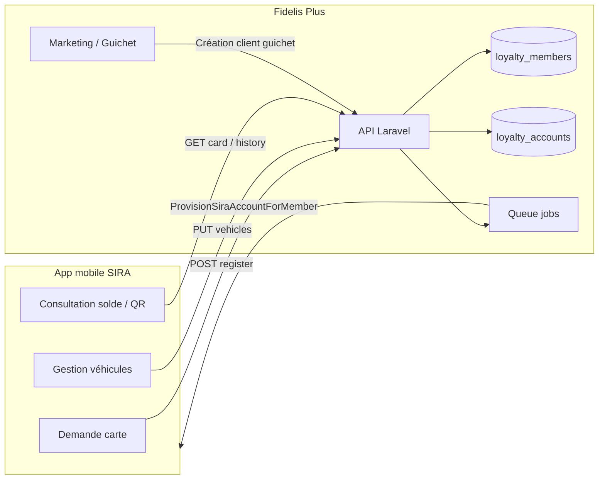
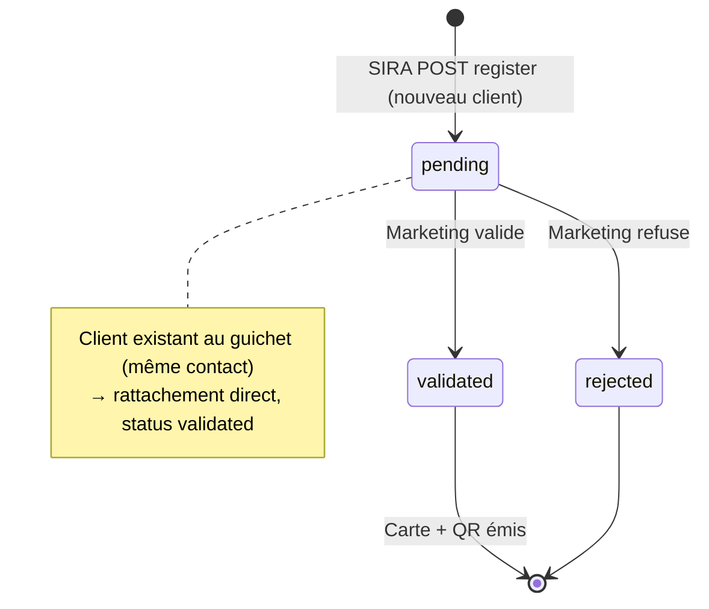

# Intégration SIRA ↔ Fidelis Plus — Carte fidélité & Marketing

Documentation opérationnelle : comment créer un client, comment pousser/synchroniser les données entre l'app mobile **SIRA** et le back-office **Fidelis Plus Marketing**.

> **Périmètre** : fidélité, guichet, app client SIRA.  
> **Hors périmètre** : synchronisation Odoo (voir `docs/openapi/odoo-integration-v1.yaml`).

---

## 1. Vue d'ensemble



### Deux directions de synchronisation

| Direction | Déclencheur | Mécanisme | Fichier clé |
|-----------|-------------|-----------|-------------|
| **SIRA → Fidelis** | Client demande une carte dans SIRA | API REST entrante (SIRA appelle Fidelis) | `LoyaltySiraIntegrationController` |
| **Fidelis → SIRA** | Client créé au guichet/marketing | Job asynchrone en queue | `ProvisionSiraAccountForMember` + `SiraClient` |

### Principe clé : pas de doublon

- Un **`LoyaltyMember`** est la fiche client fidélité propre au marketing (table `loyalty_members`).
- Elle est **indépendante** du CRM commercial (`companies` / `users`), sauf si le marketing émet une carte pour un client CRM existant via `bootstrap`.
- Le rattachement SIRA ↔ Fidelis se fait par :
  - `sira_client_id` (identifiant unique côté SIRA), ou
  - **numéro de contact** (matching normalisé sans espaces/ponctuation) si le client existait déjà au guichet sans compte SIRA.

---

## 2. Modèle de données

### Tables principales

| Table | Rôle |
|-------|------|
| `loyalty_members` | Fiche client fidélité (particulier ou entreprise) |
| `loyalty_accounts` | Compte points + numéro de carte + QR |
| `loyalty_member_vehicles` | Véhicules déclarés dans SIRA, sync vers Fidelis |
| `loyalty_card_batches` | Lots de cartes vierges pré-imprimées |
| `loyalty_pos_scan_events` | Historique des scans en station |

### Champs importants — `loyalty_members`

| Champ | Valeurs | Description |
|-------|---------|-------------|
| `type` | `particulier` / `entreprise` | Segment client |
| `source` | `guichet` / `sira` | Origine de la fiche |
| `status` | `validated` / `pending` / `rejected` | Cycle de validation |
| `sira_client_id` | string nullable | ID SIRA une fois rattaché |
| `sira_provisioning_status` | `not_applicable` / `pending` / `provisioned` / `failed` | État du push Fidelis → SIRA |
| `contact` | téléphone | Clé de dédoublonnage |
| `requested_at` | datetime | Date de demande SIRA |

### Types de compte fidélité — `loyalty_accounts.holder_type`

| Type | Description |
|------|-------------|
| `member` | Client marketing (`loyalty_members`) |
| `company` | Société CRM (`companies`) |
| `user` | Particulier CRM (`users` role=client) |
| `unassigned` | Carte vierge pré-imprimée, pas encore associée |

---

## 3. Configuration

### Variables d'environnement (`.env`)

```env
# SIRA appelle Fidelis (auth Bearer sur routes /integrations/sira/*)
SIRA_API_TOKEN=votre-jeton-partage

# Fidelis appelle SIRA (auth Bearer sur SiraClient)
SIRA_OUTBOUND_BASE_URL=https://api-sira.example.com
SIRA_OUTBOUND_TOKEN=votre-jeton-sortant
```

| Variable | Sens | Utilisé par |
|----------|------|-------------|
| `SIRA_API_TOKEN` | Entrant : SIRA → Fidelis | Middleware `VerifySiraToken` |
| `SIRA_OUTBOUND_BASE_URL` | Sortant : Fidelis → SIRA | `SiraClient` |
| `SIRA_OUTBOUND_TOKEN` | Sortant : Fidelis → SIRA | `SiraClient` |

### Queue (obligatoire pour le push Fidelis → SIRA)

Le job `ProvisionSiraAccountForMember` est dispatché en queue. Sans worker :

```bash
# Développement
php artisan queue:work

# Production (voir docs/ops/production-cron-queue-setup.md)
# Le scheduler lance queue:work --stop-when-empty chaque minute
```

Vérifier les jobs en attente :

```sql
SELECT * FROM jobs ORDER BY id DESC LIMIT 10;
```

---

## 4. Flux A — Client créé au guichet (Fidelis → SIRA)

**Qui** : caissier, marketing, admin marketing  
**Où** : interface guichet Fidelis Plus  
**Résultat** : fiche `LoyaltyMember` + provisioning SIRA automatique + carte physique à associer

### Étapes

```
1. POST /api/v1/loyalty/members          → Crée le membre (source=guichet, status=validated)
2. Job ProvisionSiraAccountForMember     → Push vers SIRA en arrière-plan
3. POST /api/v1/loyalty/members/{id}/assign-card  → Scan QR carte vierge → association
```

### 4.1 Créer le client au guichet

```http
POST /api/v1/loyalty/members
Authorization: Bearer {token_sanctum_caissier_ou_marketing}
Content-Type: application/json

{
  "type": "particulier",
  "nom": "KOUASSI",
  "prenom": "Aya",
  "contact": "+225 07 00 11 22 33",
  "email": "aya.kouassi@example.ci"
}
```

**Réponse (201)** :

```json
{
  "status": "success",
  "message": "Client fidélité créé. Associez-lui une carte physique.",
  "data": {
    "member": {
      "id": 42,
      "source": "guichet",
      "status": "validated",
      "sira_provisioning_status": "pending"
    }
  }
}
```

### 4.2 Push automatique vers SIRA (job)

Le job `ProvisionSiraAccountForMember` exécute :

```
1. GET  {SIRA}/partners/fidelis/users/lookup?phone={contact}
       → Si exists=true  : récupère sira_client_id, statut = provisioned
       → Si exists=false : passe à l'étape 2
2. POST {SIRA}/partners/fidelis/users
       Body: { type, nom, prenom, nom_entreprise, contact, email }
       → Reçoit { sira_client_id, login, temporary_password }
3. Met à jour loyalty_members.sira_client_id
4. Envoie email SiraAccessProvided si email renseigné
```

**En cas d'échec** (SIRA indisponible, timeout) :

- `sira_provisioning_status` = `failed`
- La création Fidelis **n'est pas annulée**
- Relance manuelle : `POST /api/v1/loyalty/members/{id}/retry-provisioning`

### 4.3 Associer une carte physique

Les cartes sont générées en masse à l'avance (voir § 6). Au guichet, on scanne le QR d'une carte vierge :

```http
POST /api/v1/loyalty/members/{id}/assign-card
Authorization: Bearer {token}
Content-Type: application/json

{
  "qr_payload": "{...payload QR signé de la carte vierge...}"
}
```

---

## 5. Flux B — Demande depuis SIRA (SIRA → Fidelis)

**Qui** : client final dans l'app SIRA  
**Résultat** : demande en attente → validation marketing → carte fidélité + QR virtuel

### Cycle de vie



### 5.1 Inscription carte depuis SIRA

```http
POST /api/v1/integrations/sira/loyalty/register
Authorization: Bearer {SIRA_API_TOKEN}
Content-Type: application/json

{
  "sira_client_id": "SIRA-12345",
  "type": "particulier",
  "contact": "+225 07 00 11 22 33",
  "email": "client@example.ci",
  "nom": "KOUASSI",
  "prenom": "Aya",
  "vehicles": [
    {
      "sira_vehicle_id": "VEH-001",
      "registration": "AB-123-CD",
      "brand": "Toyota",
      "model": "Corolla",
      "color": "Blanc"
    }
  ]
}
```

**Réponses possibles** :

| HTTP | status | Signification |
|------|--------|---------------|
| 201 | `success` | Client déjà validé (guichet) ou demande approuvée → carte créée |
| 202 | `pending` | Nouvelle demande → en attente validation marketing |
| 401 | `error` | Token SIRA invalide |

**Payload carte (201)** :

```json
{
  "status": "success",
  "message": "Carte fidélité créée.",
  "data": {
    "sira_client_id": "SIRA-12345",
    "display_name": "Aya KOUASSI",
    "card_number": "FID-00001234",
    "qr_payload": "...",
    "points_balance": 0
  }
}
```

### 5.2 Dédoublonnage automatique

Si un `LoyaltyMember` existe déjà avec le **même numéro de contact** (normalisé) et `sira_client_id` vide :

- SIRA reçoit la carte immédiatement (HTTP 201)
- Pas de second compte créé
- `sira_client_id` est renseigné sur la fiche existante

### 5.3 Validation marketing (demandes en attente)

**Lister les demandes** :

```http
GET /api/v1/loyalty/members/requests
Authorization: Bearer {token_marketing}
```

**Valider** :

```http
POST /api/v1/loyalty/members/{id}/validate
Authorization: Bearer {token_marketing}
```

→ Crée le `LoyaltyAccount`, génère le QR, retourne `qr_payload`.

**Refuser** :

```http
POST /api/v1/loyalty/members/{id}/reject
Content-Type: application/json

{ "reason": "Documents incomplets" }
```

### 5.4 Sync véhicules SIRA → Fidelis

À chaque ajout/modification/suppression de véhicule dans SIRA, envoyer **l'état complet** de la liste :

```http
PUT /api/v1/integrations/sira/loyalty/{siraClientId}/vehicles
Authorization: Bearer {SIRA_API_TOKEN}
Content-Type: application/json

{
  "vehicles": [
    {
      "sira_vehicle_id": "VEH-001",
      "registration": "AB-123-CD",
      "brand": "Toyota",
      "model": "Corolla",
      "color": "Blanc"
    }
  ]
}
```

Fidelis **remplace** toute la liste (pas de diff incrémental côté SIRA).

### 5.5 Consultation carte / historique (SIRA)

```http
GET /api/v1/integrations/sira/loyalty/{siraClientId}
Authorization: Bearer {SIRA_API_TOKEN}
```

```http
GET /api/v1/integrations/sira/loyalty/{siraClientId}/history?per_page=20
Authorization: Bearer {SIRA_API_TOKEN}
```

| Statut membre | Réponse |
|---------------|---------|
| `pending` | HTTP 202 — en attente validation |
| `rejected` | HTTP 404 — demande refusée |
| `validated` | HTTP 200 — carte + solde + QR |

---

## 6. Flux C — Émission carte pour client CRM existant

**Qui** : marketing  
**Cas** : la société ou le particulier existe déjà dans le CRM commercial

### 6.1 Rechercher / créer un client CRM

```http
GET  /api/v1/loyalty/lookup/companies?search=CIERIA
POST /api/v1/loyalty/lookup/companies   → { "name": "...", "phone": "..." }
GET  /api/v1/loyalty/lookup/client-users?search=Kouassi
POST /api/v1/loyalty/lookup/client-users → { "first_name", "last_name", "phone", "email" }
```

Les sociétés créées depuis le flux fidélité portent `created_via_marketing = true`.

### 6.2 Émettre la carte (bootstrap)

```http
POST /api/v1/loyalty/accounts/bootstrap
Authorization: Bearer {token_marketing}
Content-Type: application/json

{
  "company_id": 123,
  "qr_payload": "{...optionnel : QR carte vierge...}"
}
```

Ou pour un particulier CRM :

```json
{ "user_id": 456 }
```

→ Crée le `LoyaltyAccount` (`holder_type` = `company` ou `user`).

### 6.3 Télécharger le PDF / QR

```http
GET /api/v1/loyalty/accounts/{id}/qr-payload
GET /api/v1/loyalty/accounts/{id}/card-pdf
```

---

## 7. Flux D — Cartes vierges en masse

**Qui** : marketing  
**Objectif** : imprimer des cartes physiques à l'avance, les distribuer au guichet

### Étapes

```
1. POST /api/v1/loyalty/card-templates     → Créer un modèle (particulier/entreprise)
2. POST /api/v1/loyalty/card-batches       → Générer N cartes vierges (holder_type=unassigned)
3. GET  /api/v1/loyalty/card-batches/{id}/download → PDF à imprimer
4. PATCH /api/v1/loyalty/card-batches/{id}/status  → Marquer "printed" après impression
5. Au guichet : assign-card (§ 4.3)        → Associer carte vierge ↔ client
```

Chaque carte vierge a déjà un `public_uuid` et un QR signé en base.

---

## 8. API SIRA — Contrat sortant (Fidelis → SIRA)

Attendu côté SIRA (à valider avec leur équipe) :

### Lookup utilisateur

```http
GET {SIRA_OUTBOUND_BASE_URL}/partners/fidelis/users/lookup?phone=+2250700112233
Authorization: Bearer {SIRA_OUTBOUND_TOKEN}
```

**Réponse attendue** :

```json
{
  "exists": true,
  "sira_client_id": "SIRA-12345"
}
```

### Création utilisateur

```http
POST {SIRA_OUTBOUND_BASE_URL}/partners/fidelis/users
Authorization: Bearer {SIRA_OUTBOUND_TOKEN}
Content-Type: application/json

{
  "type": "particulier",
  "nom": "KOUASSI",
  "prenom": "Aya",
  "nom_entreprise": null,
  "contact": "+225 07 00 11 22 33",
  "email": "aya@example.ci"
}
```

**Réponse attendue** :

```json
{
  "sira_client_id": "SIRA-12345",
  "login": "aya@example.ci",
  "temporary_password": "TempPass123!"
}
```

---

## 9. API SIRA — Contrat entrant (SIRA → Fidelis)

Base URL Fidelis : `{APP_URL}/api/v1/integrations/sira`

| Méthode | Route | Description |
|---------|-------|-------------|
| POST | `/loyalty/register` | Demande / création carte |
| GET | `/loyalty/{siraClientId}` | Consultation carte |
| GET | `/loyalty/{siraClientId}/history` | Historique points |
| PUT | `/loyalty/{siraClientId}/vehicles` | Sync véhicules |

**Auth** : `Authorization: Bearer {SIRA_API_TOKEN}`  
**Rate limit** : 120 req/min

---

## 10. Rôles & permissions

| Rôle | Actions |
|------|---------|
| `caissier` | Créer membre guichet, assigner carte, scan POS |
| `marketing` | Tout le back-office fidélité, validation demandes SIRA |
| `admin_marketing` | Idem + réglages programme, ajustements points |
| `super_admin` | Accès complet |

Routes SIRA (`/integrations/sira/*`) : **pas de session Sanctum** — jeton de service uniquement.

---

## 11. Dashboard marketing

Statistiques agrégées en un appel :

```http
GET /api/v1/loyalty/stats/dashboard
Authorization: Bearer {token_marketing}
```

Retourne :

- Comptes actifs (particulier / entreprise)
- Points en circulation
- Scans de la semaine
- Demandes en attente (`member_requests`)
- Provisioning SIRA en échec (`sira_failed`)
- Stock cartes vierges (`blank_available`)
- Lots à imprimer (`batches_to_print`)

---

## 12. Tests & vérification

### Checklist manuelle — Guichet → SIRA

```
□ Créer un membre via POST /loyalty/members
□ Vérifier jobs : SELECT * FROM jobs (ProvisionSiraAccountForMember)
□ Lancer queue:work si dev local
□ Vérifier loyalty_members.sira_client_id renseigné
□ Vérifier sira_provisioning_status = provisioned
□ Vérifier email SiraAccessProvided reçu (si email)
□ Associer carte vierge via assign-card
□ Scanner en station (POST /loyalty/pos/scan)
```

### Checklist manuelle — SIRA → Marketing

```
□ POST /integrations/sira/loyalty/register → HTTP 202 pending
□ Voir la demande dans GET /loyalty/members/requests
□ POST /loyalty/members/{id}/validate → carte + QR
□ GET /integrations/sira/loyalty/{id} → solde + QR
□ PUT /integrations/sira/loyalty/{id}/vehicles → véhicules sync
□ Scan POS : immatriculation proposée automatiquement
```

### Tests automatisés existants

```bash
cd fidelis_plus
php artisan test --filter=Loyalty
php artisan test --filter=SecurityTest   # inclut vérif token SIRA
```

### Logs à surveiller

```bash
tail -f storage/logs/laravel.log | grep -i sira
```

Messages typiques :

- `SiraClient::lookupUser a échoué` → SIRA indisponible ou URL/token incorrect
- `SiraClient::createUser a échoué` → erreur création côté SIRA
- `Jeton SIRA invalide` → `SIRA_API_TOKEN` ne correspond pas

---

## 13. Dépannage

| Symptôme | Cause probable | Action |
|----------|----------------|--------|
| `sira_provisioning_status = failed` | SIRA down, mauvais token/URL sortant | Vérifier `.env`, relancer `retry-provisioning` |
| Demande SIRA reste `pending` | Marketing n'a pas validé | `POST /members/{id}/validate` |
| HTTP 401 sur routes SIRA | `SIRA_API_TOKEN` incorrect | Aligner token Fidelis ↔ SIRA |
| Doublon de compte | Contacts différents (format) | Normaliser le téléphone (+225...) |
| Carte vierge déjà utilisée | QR scanné 2 fois | Générer nouveau lot |
| Job jamais exécuté | Queue non traitée | `php artisan queue:work` ou cron prod |
| Client guichet + SIRA = 1 seule carte | Dédoublonnage par contact | Comportement normal |

---

## 14. Fichiers source (référence développeur)

| Fichier | Rôle |
|---------|------|
| `app/Services/Sira/SiraClient.php` | Client HTTP Fidelis → SIRA |
| `app/Http/Controllers/Api/LoyaltySiraIntegrationController.php` | API SIRA → Fidelis |
| `app/Http/Controllers/Api/LoyaltyMemberController.php` | Guichet + validation marketing |
| `app/Http/Controllers/Api/LoyaltyMarketingLookupController.php` | Lookup CRM + dashboard |
| `app/Jobs/ProvisionSiraAccountForMember.php` | Job provisioning SIRA |
| `app/Http/Middleware/VerifySiraToken.php` | Auth token entrant |
| `app/Services/Loyalty/LoyaltyAccountFactory.php` | Création comptes fidélité |
| `app/Http/Controllers/Api/LoyaltyCardBatchController.php` | Cartes vierges en masse |
| `routes/api.php` | Déclaration des routes (l.51-57, 127+, 268+) |
| `config/services.php` | Configuration tokens SIRA |

---

## 15. Résumé des scénarios

| Scénario | Qui crée | Push vers | Carte émise quand |
|----------|----------|-----------|-------------------|
| Guichet | Caissier/marketing | SIRA (job auto) | Après assign-card (physique) |
| App SIRA (nouveau) | Client SIRA | — | Après validation marketing |
| App SIRA (ex-guichet) | Client SIRA | — | Immédiatement (rattachement) |
| CRM existant | Marketing | — | Bootstrap immédiat |
| Cartes pré-imprimées | Marketing (batch) | — | Au scan assign-card |

---

*Dernière mise à jour : 2026-08-18*
